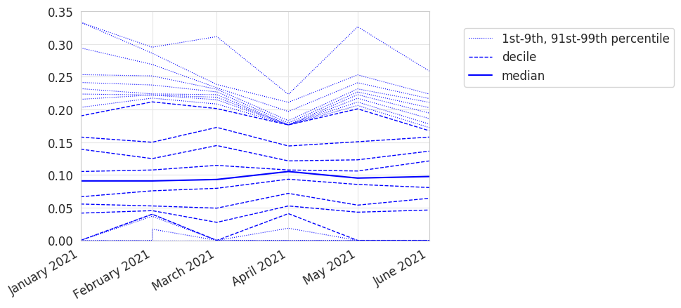

# deciles-charts

deciles-charts generates a line chart for each [measure table][1] in an input directory.
The line chart has time on the horizontal axis (`x`) and value on the vertical axis (`y`).
Deciles are plotted as dashed lines;
the median is plotted as a solid line.
For example, the following deciles chart was generated from dummy data:



[Using deciles to communicate variation][2] has several advantages when compared to the alternatives.
Consequently, deciles charts are used on [OpenPrescribing.net][]
and in several OpenSAFELY publications, such as [Curtis _et al._ (2021)][3].

## Usage

In summary:

* Use [cohort-extractor][] to extract several weekly or monthly cohorts.
* Use cohort-extractor to generate one or more measure tables from these cohorts.
* Use deciles-charts to generate a deciles chart for each measure table.

Let's walk through an example _project.yaml_.

The following cohort-extractor action extracts several monthly cohorts:

```yaml
generate_cohort:
  run: >
    cohortextractor:latest generate_cohort
      --study-definition study_definition
      --index-date-range "2021-01-01 to 2021-06-30 by month"
  outputs:
    highly_sensitive:
      cohort: output/input_2021-*.csv
```

The following cohort-extractor action generates one or more measure tables from these cohorts:

```yaml
generate_measures:
  run: >
    cohortextractor:latest generate_measures
      --study-definition study_definition
  needs: [generate_cohort]
  outputs:
    moderately_sensitive:
      measure: output/measure_*.csv
```

Finally, the following deciles-charts reusable action generates a deciles chart for each measure table.
Remember to replace `[version]` with [a deciles-charts version][4]:

```yaml
generate_deciles_charts:
  run: >
    deciles-charts:[version]
      --input-files output/measure_*.csv
      --output-dir output
  needs: [generate_measures]
  outputs:
    moderately_sensitive:
      deciles_charts: output/deciles_chart_*.png
```

For each measure table, there will now be a corresponding deciles chart.
For example, given a measure table called `measure_has_sbp_event_by_stp_code.csv`,
there will now be a corresponding deciles chart called `deciles_chart_has_sbp_event_by_stp_code.png`.

## Configuration

Pass configuration via the `config` property.
For example:

```yaml
generate_deciles_charts:
  run: >
    deciles-charts:[version]
      --input-files output/measure_*.csv
      --output-dir output
  config:
    show_outer_percentiles: false
    charts:
      output: true
  needs: [generate_measures]
  outputs:
    moderately_sensitive:
      deciles_charts: output/deciles_chart_*.png
```

| Configuration            | Description                                                                                         |
| ------------------------ | --------------------------------------------------------------------------------------------------- |
| `show_outer_percentiles` | Show the top and bottom percentiles, as well as the deciles                                         |
| `charts.output`          | Generate a deciles chart for each measure table that is matched by the `--input-files` glob pattern |

## Notes for developers

Please see [_DEVELOPERS.md_](DEVELOPERS.md).

[1]: https://docs.opensafely.org/measures/
[2]: https://www.thedatalab.org/blog/2019/04/communicating-variation-in-prescribing-why-we-use-deciles/
[3]: https://www.opensafely.org/research/2021/service-restoration-observatory-1/
[4]: https://github.com/opensafely-actions/deciles-charts/tags
[cohort-extractor]: https://docs.opensafely.org/actions-cohortextractor/
[OpenPrescribing.net]: https://openprescribing.net/
